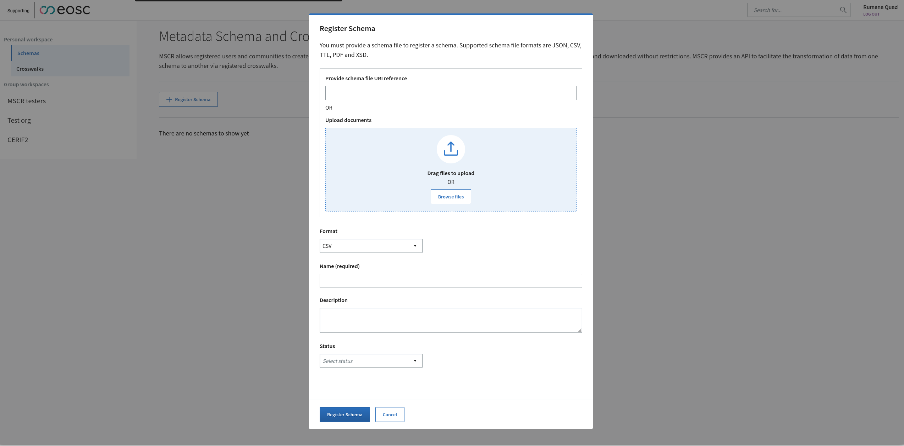

# Metadata Schema and Crosswalk Registry
MSCR allows registered users and communities to create, register and version schemas and crosswalks with PIDs. The published content can be searched, browsed and downloaded without restrictions. MSCR provides an API to facilitate the transformation of data from one schema to another via registered crosswalks. 

- MSCR supports registering schemas/crosswalks hosted elsewhere as well hosting them in the repository
- It offers basic data management support: PIDs, metadata, versioning and provenance information.
- Supports a GUI for visually creating crosswalks between metadata schemas
- Provides an API and guidelines for organisations to register and maintain metadata schemas and crosswalks
- When registering metadata schema users are able to provide detailed data-type information for fields and attributes using the DTR
- Provides a (meta-)data interoperability service that facilitates conversion between metadata schemas

## Getting Started

### Login
To be able to create and register contents in MSCR,user needs to login with proper credentials. MSCR using EOSC AAI and currently supports Google and Orcid as means of authentication. The current test version of MSCR deployment can be found at https://mscr-test.rahtiapp.fi.

### Registering Schema

### Schema Detail View
If you click on the registered schema from the schema list, it will navigate to schema metadata and visualization view. This view have three tabs containing schema metadata, schema visualization and schema version history.
#### Schema Metadata 

#### Schema Visulaization

#### Schema Version History

### Registering Crosswalks

### Creating Crosswalks

### Search Content

