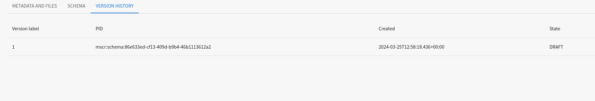

# Metadata Schema and Crosswalk Registry
MSCR allows registered users and communities to create, register and version schemas and crosswalks with PIDs. The published content can be searched, browsed and downloaded without restrictions. MSCR provides an API to facilitate the transformation of data from one schema to another via registered crosswalks. 

- MSCR supports registering schemas/crosswalks hosted elsewhere as well hosting them in the repository
- It offers basic data management support: PIDs, metadata, versioning and provenance information.
- Supports a GUI for visually creating crosswalks between metadata schemas
- Provides an API and guidelines for organisations to register and maintain metadata schemas and crosswalks
- When registering metadata schema users are able to provide detailed data-type information for fields and attributes using the DTR
- Provides a (meta-)data interoperability service that facilitates conversion between metadata schemas

## Getting Started

### Login
To be able to create and register contents in MSCR, user needs to login with proper credentials. MSCR uses EOSC AAI and currently supports Google and Orcid as means of authentication. The current test version of MSCR deployment can be found at [https://mscr-test.rahtiapp.fi](https://mscr-test.rahtiapp.fi).

### Registering Schema
Users can register their schemas of different formats in the MSCR and it will be stored with a resolvable handle in MSCR server. These handles can be used to reference the schema stored in MSCR. User can register schema either using an URI of already published schema elsewhere or uploading a schema file to MSCR Registry

The steps to add a schema in MSCR are as follows:

- Provide an URI or upload a schema file
- Select the file format for the intended schema.
- Add name and description(optional) for the schema.
- Add status (Default status should be DRAFT for the registered contents)
- Click Register button to continue.

### Schema Detail View
If you click on the registered schema from the schema list, it will navigate to schema metadata and visualization view. This view has three tabs containing schema metadata, schema visualization and schema version history.

#### Schema Metadata 
You can see the schema specific details and the related files in the schema metadata view. If the user has the correct rights, schema metadata is editable and changes will be saved.

#### Schema Visualization
Schema visualization tab offers a tree view structure for the registered schema. Schemas are converted to an MSCR specific format and tree view is generated from that. The view may be empty for certain formats like PDF that cannot be rendered as a tree.

#### Schema Version History
MSCR allows users to create and store different versions and variants for registered schemas. Schema version history tab consists of all the available versions for that specific schema.

### Registering Crosswalks
Users can register their existing crosswalks with MSCR and can view the crosswalk in crosswalk editor if the crosswalk format is supported by MSCR. For registering a crosswalk follow the following steps

- Select the source schema and target schema from the dropdown list. Remember, source and target schemas also need to be registered with MSCR and public before registering the crosswalk.
- Add the crosswalk file in the MSCR supported formats. See more in the supported formats link.
- Add name and description for the crosswalk.
- Draft state should be selected while registering new content.

### Crosswalk Editor
MSCR offers a Crosswalk Editor where users can create mappings from the source schema to target schema and can export the generated mappings in MSCR supported formats.

- Select the source and target schema. Again, schemas should be registered and public in MSCR. When creating a new crosswalk, only schemas that can be rendered as trees are available.
- Add Name and Description(optional) for the Crosswalk. 
- Click Create Crosswalk button will lead to Crosswalk Editor Page.

 
 

#### Creating New Crosswalk
Crosswalk editor is used to create mappings between schema fields which can be saved as new crosswalk. MSCR Crosswalk Editor offers a treeview of the selected source and target schemas where user can map the attributes between schemas and the mappings will be saved. 

- To start creating mappings, please click the action menu on the top right corner of the editor window and select edit.

 - After that, user can select attributes from two schemas present in left and right tree view and after selecting attributes to map, the mapping button between the two schema trees will be enabled.

- After clicking the mapping icon, pop up dialog will be opened where user can add some more details about the mapping. When it is done, Save button should be clicked to save the mapping. 

- After saving, list of mappings will appear below the schemas.

### Search Content

