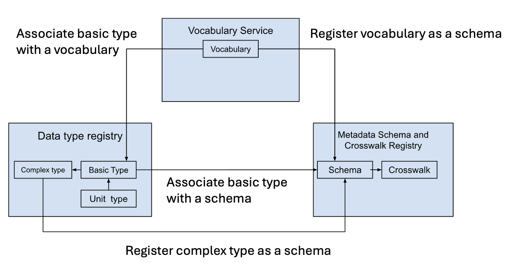

This document describes MSCR and its features and content through the the lens of maintaining and using semantic artefacts. Corcho et. al [1] define semantic artefacts as a "machine-actionable formalisation (represented using appropriate formats and serialisations, including RDF and non-RDF standards) of a conceptualisation, enabling sharing and reuse by humans and machines", which includes for example different kinds of vocabularies, ontologies and data schemas as well term mappings and schema crosswalks. MSCR is a semantic artefact repository that handles all of the these categories. 

## MSCR content 

The main domain types of MSCR are schemas and crosswalks. Schemas in MSCR cover simple and complex vocabularies, ontologies and well as (meta) data schemas. See table below for a summary of supported types. 
A crosswalk is defined as a set of mapping in the context of the MSCR. 

**Summary of MSCR content types and subtypes**

| Format | Type | Subtype | Notes |
|--------|------|---------|-------|
| CSV | Schema | Data schema | Simplest form of data schema that describes tabular and can only convey the name and order of the string type of columns |
| XSD | Schema | Data schema | | 
| JSON schema | Schema | Data schema | |
| RDFS | Schema | Data schema | Can be used to define the structure of an RDF graph. Visualization of the schema is based on the global `rdfs:domain` and `rdfs:range` definitions that must be part of the registered schema |
| SHACL | Schema | Data schema | The recommended format for describing RDF graph structure. |
| SKOS | Schema | Vocabulary | Visualization support hierarchy related SKOS properties.|
| ENUM | Schema | Vocabulary | Simple list of vocabulary terms (one per line) |
| OWL | Schema | Ontology | |
| SSSOM | Crosswalk | Semantic mapping | |
| MSCR | Crosswalk | Semantic mapping / Schema crosswalk | Native MSCR format produced by the crosswalk editor, which can be used to create mappings between all schemas types supported by the MSCR | 
| XSLT | Crosswalk | Schema crosswalk | Not editable with the crosswalk editor. Stored as a file with metadata | 
| PDF | Schema/Crosswalk | Unknown | Not editable with the crosswalk editor. Stored as a file with metadata | 

## Integrations with semantic artefact services

### FAIRCORE4EOSC services

This section has been extracted from FAIRCORE4EOSC Delirable D4.1 [2].

The services within the WP4 (MSCR, DTR, Vicabulary Service) are dealing with similar and related types of content, and as a result they provide opportunities for integration. For the MSCR there are two main use cases for vocabulary and DTR integration: schema editing and schema mapping. Although MSCR is not a schema editor, it does provide schema editing features that are related to creating crosswalks. 

The MSCR allows users to associate properties of a registered schema with basic data types defined in the DTR. This means that one can, for example, replace a generic "string" datatype in a JSONSchema specification, with a more expressive DTR data type, such as "handle", which can provide additional textual description of the values as well as a regular expression pattern for value validation. This is helpful for mapping especially if the person creating the crosswalk is not that familiar with the actual instance data being mapped. For example, a handle field might contain only the identifier or it could be used to store a full URL (2341/12345 vs. hdl.handle.net/2341/12345). Associating property with a DTR data type reference can make the format explicit and hence inform the user whether a function needs to be applied to remove or append the "hdl.handle.net" prefix.

In respect to the schema mapping use case, both DTR and the Vocabulary Service are capable of exporting content that can be used as the source for MSCR schema registration. The reason why one might like to register content from these systems can be for example data transformation or semantic mapping. The DTR type API (ref X) can export complex data types as JSON schemas. Although these schemas are more for data transformation purposes, they do contain JSON-LD elements, namely @id and @type, which make them also suitable for other mapping cases. From the MSCR's perspective. vocabularies are "just" another type of schema and therefore content maintained in the Vocabulary Service can be registered with MSCR for semantic mapping purposes. Integration is made possible by the SKOS export feature of the Vocabulary Service. See figure below for an overview of the FC4E service integrations.



### Registering content from other semantic artefact registries for mapping

URL based schema registration should be preferred over file uploads from the local machine, because the source URL is recorded as part of the registered schema's metadata. 

**Vocabulary services**

Requirement for registering SKOS vocabularies for mapping:
* Use format `SKOSRDF` and turtle RDF serialization. 
* Use Turtle RDF serialization for file upload.

If the service is capable of exporting vocabulary as list of terms (one per line) the vocabulary can be registered using `ENUM` format.  

Example: Register vocabulary from SKOSMOS:

```
curl -X PUT /datamodel-api/v2/frontend/schemaFull -H 'Authorization: Bearer <token>' -H 'Content-type: multipart/form' -F contentURL=https://finto.fi/rest/v1/cer/data?format=text/turtle -F "metadata={
    "title": "
Clean Energy Research ontology of The Bank of Finnish Terminology in Art and Sciences",
    "format": "SKOSRDF",
    "publisher": "National Library of Finland",
    "license": "
    http://creativecommons.org/licenses/by/3.0/",
    "language": "en"
}"
```

**Ontology services**

Example: Register ontology from Agroportal:

```
curl -X PUT /datamodel-api/v2/frontend/schemaFull -H 'Authorization: Bearer <token>' -H 'Content-type: multipart/form' -F contentURL=https://data.industryportal.enit.fr/ontologies/MDS/submissions/3/download?apikey=019adb70-1d64-41b7-8f6e-8f7e5eb54942 -F "metadata={
    "title": "
Materials Data Science Ontology",
    "description": "The Materials Data Science Ontology is a low level ontology that unifies knowlege in Materials and Data Science communities by integrating domain-specific terminologies under the same overarching ontology.",
    "issued": "2024-08-02",
    "format": "OWL",
    "license": "
    http://creativecommons.org/licenses/by/3.0/",
    "language": "en"
}"
```

**schema repositories**

Example: Register schemas from CLARIN Component registry

```
curl -X PUT /datamodel-api/v2/frontend/schemaFull -H 'Authorization: Bearer <token>' -H 'Content-type: multipart/form' -F contentURL=https://catalog.clarin.eu/ds/ComponentRegistry/rest/registry/1.1/profiles/clarin.eu:cr1:p_1407745712081/xsd -F "metadata={
    "title": "
LinguisticFieldtrip",
    "description": " Linguistic field trip (expedition) involving work with native speakers (consultants). Also covers work with native speakers at home institution.",
    "format": "XSD",
    "language": "en"
}"
```

## API usage

All read APIs are usable without an API key. For mutations (create, update, delete) and some contextual read operations (e.g. search personal content) require an API key that is always tied to a user account. There are currently no machine-to-machine accounts available. See page ["API getting started"](/mscr/api-getting-started/) for instructions on how to create and regenerate an API key. 

Developer documentation for the API is available at [https://mscr-release.2.rahtiapp.fi/swagger](https://mscr-release.2.rahtiapp.fi/swagger). The API is divided into five sections: Schema, Crosswalk, Subscription, Transformation and Frontend. 

Endpoints under the "Frontend" section are meant to used by the MSCR's own UI application and are not designed to be consumed by other applications. Nothing of course prevents one from using those endpoints as well for external integrations, but the development of the endpoint will always be driven by the internal requirements. 


### Harvesting content metadata

MSCR does not currently provide a conveniet way to harvest all or selected content. 

### Searching for crosswalk based on schemas

Searching crosswalk between two crosswalks:
```
/datamodel-api/v2/frontend/mscrSearch?sourceSchemas=<schema internal id / PID>&targetSchemas=<schema internal id / PID>
```

`sourceSchemas` and `targetSchemas` parameters can be repeated to include more that one schemas as the source and target filters. Multiple input values for source and target schemas as combined with OR operator. 

### Export vocabulary mappings as SKOS

An MSCR crosswalk between two SKOS vocabularies can be exported as SKOS with the `exportFormat=SKOS` parameter:
```
/datamodel-api/v2/crosswalk/<crosswalk internal id / PID>/mapping?exportFormat=SKOS
```

The request above will return the mappings as SKOS conforming triples. It is also possible to include either the source or target vocabularies to the exported data: 
```
/datamodel-api/v2/crosswalk/<crosswalk internal id / PID>/mapping?exportFormat=SKOS&includeSource=true&includeTarget=true
```

### Working with SSSOM

[SSSOM](https://mapping-commons.github.io/sssom/) mapping file can be imported to MSCR given that both source and target schemas have been registered to the MSCR. An error will be thrown if SSSOM file contains references to URI/terms as subjects or objects of the mapping that are not part of the source or target schemas. 

After successful registration of a SSSOM file it can edited normally with the MSCR crosswalk editor. Crosswalk between combination of ENUM, SKOS and OWL schemas can be exported as SSSOM by using the `SSSOM` export format.

```
/datamodel-api/v2/crosswalk/<crosswalk internal id / PID>/mapping?exportFormat=SSSOM
```

Crosswalks between ENUM, SKOS and OWL can exported as SSSOM mappings files. The mapping file will include a basic SSSOM header information. 

### Crosswalk operationalization

Some of the crosswalks created or registered with MSCR can be exported as configurations that can be run in an external system for transforming instance data. The summary of available exported format per source and target schema pairs is summarized in the table below.

**Summary of operationalisation support**

| Source schema format | Target schema format | Supported export format |
|----------------------|----------------------|------------------|
| CSV/XSD/JSONSchema | CSV/XSD/JSONSchema | XSLT |
| CSV/XSD/JSONSchema | SHACL | RML |
| SHACL | CSV | SPARQL |
| SKOS | SKOS | SKOS |
| ENUM/SKOS/OWL | ENUM/SKOS/OWL | SSSOM |


## References

1. Corcho, O., Ekaputra, F.J., Heibi, I. et al. A maturity model for catalogues of semantic artefacts. Sci Data 11, 479 (2024). https://doi.org/10.1038/s41597-024-03185-4

2. Suominen, T., Kesäniemi, J., Cannizzaro, G., Snyder, K. P., Quazi, R., Lienhop, H., Tatum, C., Ross, S., Broeder, D., Zamani, T., Wilk, R., & Kołomański, M. (2025). FAIRCORE4EOSC Deliverable D4.1 EOSC Registries for Research Data and Metadata Interoperability and Research Activity Tracking. Zenodo. https://doi.org/10.5281/zenodo.15476608