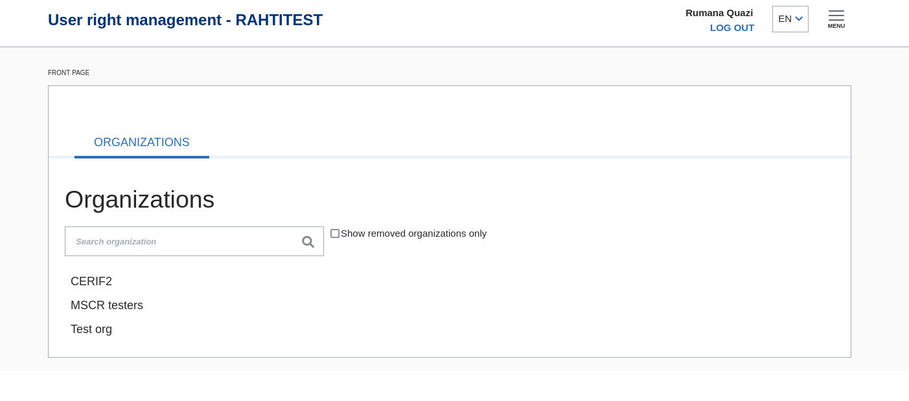
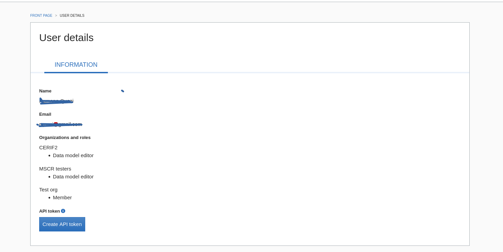

# Generating API key

- For generating API key, you need to navigate to https://mscr-test.rahtiapp.fi/groups/. This is the group management application for MSCR where users can create and manage groups. 

- Under the menu on the top right corner, navigate to user details page. Here you can find the create API token button which will create the API token and this can be used for the API calls to MSCR.

# Documentation