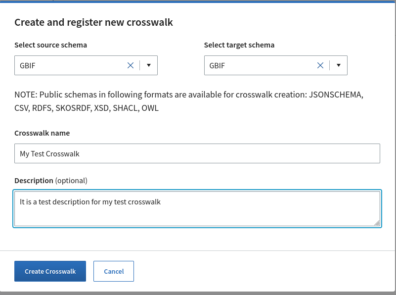
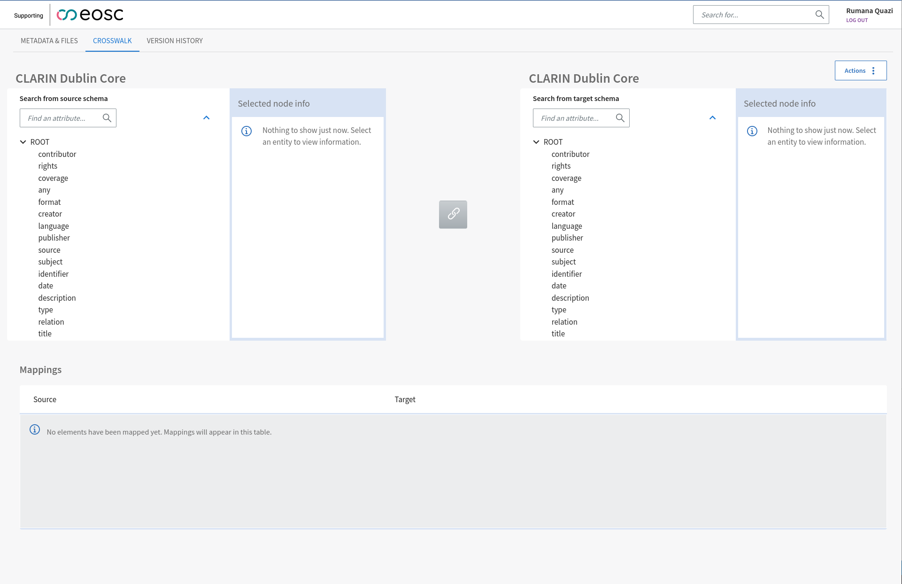
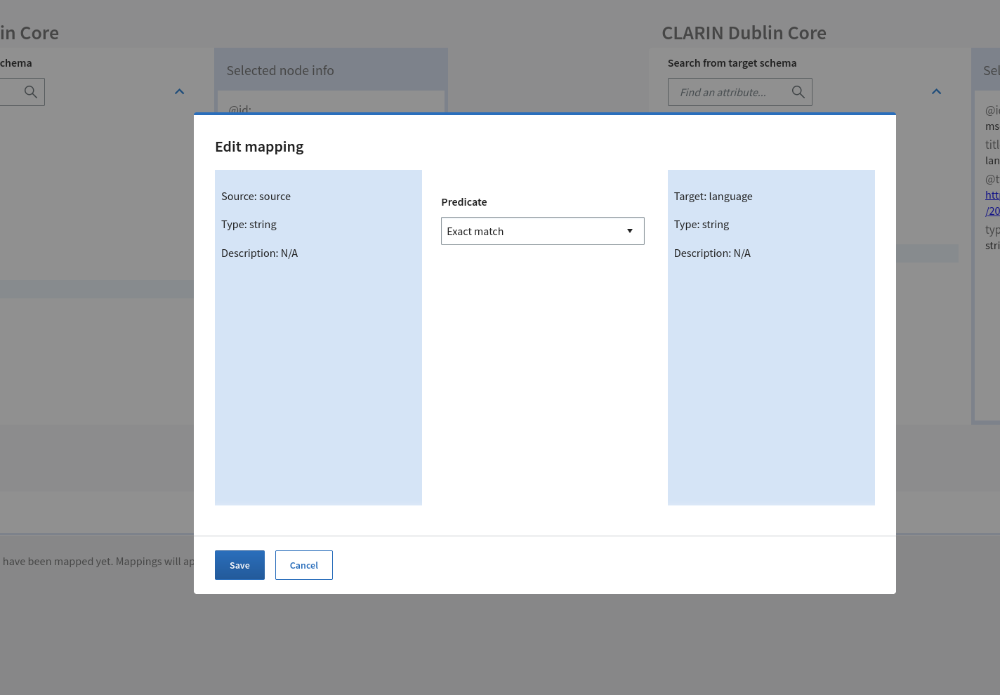

The Crosswalk Editor is an integrated tool that allows users to create and edit complex mappings between two registered MSCR schemas. The crosswalk editor supports creation of mappings between any of the following schema formats: CSV, XSD, JSON Schema, RDFS, SHACL, OWL, SKOS, and ENUM. The MSCR allows users to mix-and-match different formats freely and they are all called crosswalks in the UI. Internally, crosswalks are categorised into "crosswalk", "semantic mapping" or "semantic annotation" sub-types based on the format of the source and target schemas. The rules for determining the crosswalk sub type is summarised in table X. Sub-types describe the goal or purpose of the mapping:

- Data crosswalks: the purpose of the mappings is to transform an instance document that conforms to the source schema into another instance document that conforms to the target schema with potentially complex processing.

- Semantic mappings: describes a correspondence with possible ontological commitment between two identified entities, such as vocabulary concepts, classes or properties.

- Annotations: A set of mappings between "just a strings" i.e. a lexical tokens and identified semantic entities such as SKOS vocabulary concepts or OWL classes is categorised as semantic annotation.


## Crosswalk Editor UI

In the Crosswalk Editor UI, users can create mappings from the source schema to target schema using the UI Tool and can export the generated mappings in MSCR supported formats. 

### Creating New Crosswalk
To create a new crosswalk between two available schemas in MSCR, the following steps are needed:

- Select the source and target schema. Again, schemas should be registered and public in MSCR. When creating a new crosswalk, only schemas that can be rendered as trees are available.

- Add Name and Description(optional) for the Crosswalk. 

- Click Create Crosswalk button will lead to Crosswalk Editor Page.

 
 


Crosswalk editor is used to create mappings between schema fields which can be saved as new crosswalk. MSCR Crosswalk Editor offers a treeview of the selected source and target schemas where user can map the attributes between schemas and the mappings will be saved. 



## Crosswalk Actions

After creating a crosswalk, the following actions are available in the action menu for crosswalk: 

* Edit mappings 
* Edit metadata 
* Publish crosswalk (other status related actions)
* Add new revision
* Delete draft

### Edit Mappings 

- To start creating mappings or editing existing mappings, please click the action menu on the top right corner of the editor window and select edit.


 - After that, user can select attributes from two schemas present in left and right tree view and after selecting attributes to map, the mapping button between the two schema trees will be enabled.


- After clicking the mapping icon, pop up dialog will be opened where user can add some more details about the mapping. When it is done, Save button should be clicked to save the mapping. 





- After saving, list of mappings will appear in a different tab


### Edit Metadata
In the crosswalk Metadata tab, the basic metadata related to that crosswalk is visible. Some of the metadata fields are editable and to edit, user need to click "Edit Metadata" menu. This will enable the editable text fields and after editing finishes, user need to click save to save the changes have been made.


### Publish Crosswalk
When a crosswalk is created, it is by default in draft state and not visible to others. If the user is satisfied about the crosswalk created and the mappings, it is possible to publish the crosswalk with the "Publish crosswalk" menu. Publishing a crosswalk will create a resolvable handle for the crosswalk which can be shared with others and will be visible upon searching in MSCR registry. After publishing a content, it cannot be reverted to draft state. If one needs to change something in a published crosswalk, it can be done by creating a revision of that and editing that version of crosswalk.


### Add new revision
To create a new revision of a crosswalk, user need to select the "Add new revision" option from the crosswalks action menu. Clicking the "Add New Revision" button will open a pop up dialogue. The source and target schema cannot be changed while creating a new revision for a crosswalk. Revisions of crosswalks serves the purpose if there is need to create slightly different versions of the same crosswalk.


You need to add a name and optional description the new revision of the crosswalk. The default format for the revision of a crosswalk is "MSCR". The created revisions can be found in the version history tab.


### Delete Draft

The unpublished crosswalks which are still in draft state, can be deleted by selecting the "Delete draft" option from the action menu. Once the draft is deleted, it will not be visible or searchable anymore. But, published content cannot be deleted once it has been published.


### Example of mapping creations


## Mapping details

## Creating mappings 

### Basics

Basics about different type of mappings: semantic mappings, structural mappings

### Iterators

**Iterators in JSONSchema/XSD mappings**

When dealing with JSON or XML schemas an iterator mapping is required when the repetable entity is complex, meaning that it is of type "object" (JSON Schema) or of type complexType (XSD). For example, with the following input data: 

```
{
    "vegetables": [
        {
            "veggieLike": "true",
            "veggieName": "potato"
        },
        {
            "veggieLike": "false",
            "veggieName": "broccoli"
        }
    ]
}
```

and following target schema:


if the iterator mapping from vegetables to root/vegetable is omitted (see below)


the end result would be 

```
<root>
    <vegetables>
        <veggieName>potato broccoli</veggieName>
        <veggieLike>true false</veggieLike>
    </vegetables>
</root>
```

Where all the `veggieName` and `veggieLike` element values are outputted to a single element.

By adding an iterator mapping (see below)


The values of complex `vegetable`element properties are grouped together resulting to the following document

```
<root>
    <vegetables>
        <veggieName>potato</veggieName>
        <veggieLike>true</veggieLike>
    </vegetables>
    <vegetables>
        <veggieName>broccoli</veggieName>
        <veggieLike>false</veggieLike>
    </vegetables>
</root>
```

**Iterators in X to SHACL mappings 

Each of the SHACL NodeShape, or more precisely its target class, has an automatically generated "iterator source" property. This property is not part of the SHACL schema, but generated by the MSCR. In order to create resources with any target its iterator property must be mapped. 

### Functions

Tehre are source, mapping and target functions available in the MSCR. That means that the maximum depth of nested function is tree: 

```
target_function(mapping_function(source_function(value)))
```

The available function set varies a little based depending the foramt of source and target schemas. 

## General mapping cases

The crosswalk editor in MSCR can used to create "mappings" between any registed CSV, XSD, JSONSchema, RDFS, SHACL, OWL, SKOS an ENUM content. That is not to say that there might even be a use case for all of the possible combinations, but it still can be done. The term "mappings" in quotation marks as it is still debatable whether some content combinations should be called mappings or not. 

### Semantic entity mappings

Semantic entity mappings are mappings between identifiable things are are deemed to be significant enough to warrant a description in some partical ocntext. These kinds of things or entities can be found in the context of MSCR in vocabularies and ontologies. Strictly speaking, this would only include SKOS, RDFS and OWL, but since the MSCR generates IRI identifiers for each element of the schema we can extend it to ENUMs as well. 

The basic structure of a semantic entity mappign is a triple: source entity, predicate, target entity. In MSCR the predicate contains mapping properties found in SKOS and OWL vocabularies. 

Available SKOS predicates:

* skos:broadMatch
* skos:closeMatch
* skos:exactMatch
* skos:narrowMatch
* skos:relatedMatch

Available OWL predicates:

* owl:sameAs
* owl:equivalentClass
* owl:equivalentProperty

Functions are not available for semantic entity mappings in the MSCR UI.

Many-to-one type of mappings can be expressed in any combination of one-to-one and many-to-one mappings. The organization of the mappings will not affect the end results since purely semantic mappings do not use functions that could have differnt output depending on the input. The only difference in the end is how the mappings will look in the crosswalk and mappings tabs of the UI. 

### Mapping CSV/XML/JSON to RDF 

Basic steps:

* Map iterator source of the classe
* Map subject source of the class
* Map literator properties of the class
* For each object property
    * Map the object property 
    * Map the subject source of the class that in the the object property's range with the same configuration as in the step above


**Every generated target class must have a subject source mapping** 

Class is generated if it its iterator source is mapped and every generated class must have an iterator mapped. This basically means that one cannot generate blank nodes at the moment. 

This is due to the missing implmementation in the generator for generaing RML blank nodes. 

**There can be only one iterator and subject source mapping per target class**

The reason for this is that it is currently not possible to distinguish in the which iterator/subject source an individual mapping belongs to due to missing contextual information. 

This is how the mappings structure currently works (simplified example):

```
{
    "target": [
        "subject source"
    ],
    "source": [
        "identifier
    ]
}
```

And this is what multiple iterator/subject sources would require:

```
// Mapping 1
{
    "content": "first source"
    "target": [
        "subject source"
    ],
    "source": [
        "identifier
    ]
}
// Mapping 2
{
    "content": "second source"
    "target": [
        "subject source"
    ],
    "source": [
        "identifier
    ]
}
```


### Mappings between CSV/XML/JSON

TODO 

### Mapping RDF to others 

TODO

## Examples: 

### Simple object mapping 

<details>
    <summary>Person JSON Schema (source)</summary>
```
{
  "$id": "https://example.com/person.schema.json",
  "$schema": "https://json-schema.org/draft/2020-12/schema",
  "title": "Person",
  "type": "object",
  "required": ["firstName", "lastName", "age"],
  "additionalProperties": false,
  "properties": {
    "firstName": {
      "type": "string",
      "description": "The person's first name."
    },
    "lastName": {
      "type": "string",
      "description": "The person's last name."
    },
    "age": {
      "description": "Age in years which must be equal to or greater than zero.",
      "type": "integer",
      "minimum": 0
    }
  }
}
```
</details>

<details>
    <summary>Person XML Schema (target)</summary>
```
<?xml version="1.0" encoding="UTF-8" ?>
<xs:schema xmlns:xs="http://www.w3.org/2001/XMLSchema">
<xs:element name="root">
  <xs:complexType>
    <xs:sequence>
      <xs:element name="firstName" type="xs:string"/>
      <xs:element name="lastName" type="xs:string"/>
      <xs:element name="age" type="xs:positiveInteger"/>
    </xs:sequence>
  </xs:complexType>
  </xs:element>
</xs:schema>
```
</details>

There is no need to map an iterator because the target schema does not include any repeatable elements. All that is required are three simple mappings. 

Example of a simple mapping:


Final mappings


### Splitting and concatenating strings 

<details>
    <summary>Person JSON Schema (source)</summary>
```
{
  "$id": "https://example.com/person.schema.json",
  "$schema": "https://json-schema.org/draft/2020-12/schema",
  "title": "Person",
  "type": "object",
  "required": ["firstName", "lastName", "age"],
  "additionalProperties": false,
  "properties": {
    "firstName": {
      "type": "string",
      "description": "The person's first name."
    },
    "lastName": {
      "type": "string",
      "description": "The person's last name."
    },
    "hobbies": {
      "type": "string",
      "description": "The person's hobbies."
    },    
    "age": {
      "description": "Age in years which must be equal to or greater than zero.",
      "type": "integer",
      "minimum": 0
    }
  }
}
```
</details>

<details>
    <summary>Person XML schema (target)</summary>
```
<?xml version="1.0" encoding="UTF-8" ?>
<xs:schema xmlns:xs="http://www.w3.org/2001/XMLSchema">
<xs:element name="root">
  <xs:complexType>
    <xs:sequence>
      <xs:element name="name" type="xs:string"/>
      <xs:element name="age" type="xs:positiveInteger"/>
      <xs:element name="hobbies">
        <xs:complexType>
          <xs:element name="hobby" type="xs:string"/>
        </xs:complexType>
      </xs:element>
    </xs:sequence>
  </xs:complexType>
  </xs:element>
</xs:schema>
```
</details>

Last name and first name are concatenated with a mapping function. It is important that source propeties are in the correct order (lastName, firstName) and that the mapping function parameter includes a space (', ').


Another way producing the same end result would to use just ',' as the parameter of the mapping function and to add 'addPrefix' function to the firstName source property. 

Split function can be used to generate one or more instances of an element. In this example the value of hobbies property  will be split into `hobby` elements under `hobbies` container element. 


Final mappings:


Source document for testing: 
```
{
  "firstName": "John",
  "lastName": "Doe",
  "hobbies": "archery,fencing",
  "age": 21
}	
```
Excepted target document:
```
<?xml version="1.0" encoding="UTF-8"?>
<root>
    <name>Doe, John</name>
    <age>21</age>
    <hobbies>
        <hobby>archery</hobby>
        <hobby>fencing</hobby>
    </hobbies>
</root>
```

### Splitting value into multiple elements 

<details>
    <summary>Person XML schema (source)</summary>
```
<?xml version="1.0" encoding="UTF-8" ?>
<xs:schema xmlns:xs="http://www.w3.org/2001/XMLSchema">
<xs:element name="root">
  <xs:complexType>
    <xs:sequence>
      <xs:element name="name" type="xs:string"/>
      <xs:element name="age" type="xs:positiveInteger"/>
      <xs:element name="hobbies">
        <xs:complexType>
          <xs:element name="hobby" type="xs:string"/>
        </xs:complexType>
      </xs:element>
    </xs:sequence>
  </xs:complexType>
  </xs:element>
</xs:schema>
```
</details>

<details>
    <summary>Person JSON schema (target)</summary>
```
{
  "$id": "https://example.com/person.schema.json",
  "$schema": "https://json-schema.org/draft/2020-12/schema",
  "title": "Person",
  "type": "object",
  "required": ["firstName", "lastName", "age"],
  "additionalProperties": false,
  "properties": {
    "firstName": {
      "type": "string",
      "description": "The person's first name."
    },
    "lastName": {
      "type": "string",
      "description": "The person's last name."
    },
    "hobbies": {
      "type": "string",
      "description": "The person's hobbies."
    },    
    "age": {
      "description": "Age in years which must be equal to or greater than zero.",
      "type": "integer",
      "minimum": 0
    }
  }
}
```
</details>

Tasks:

* Split "name" element from the source document into "firstName" and "lastName" properties and remove any extra whitespace.
* Concatenate all hobbies with "|" to the target document.


Source document
```
<root>
    <name>Doe, John</name>
    <age>21</age>
    <hobbies>
        <hobby>archery</hobby>
        <hobby>fencing</hobby>
    </hobbies>
</root>	
```

Hobbies mapping


If the value of the "name" element is split using "," the latter element will have an extra white space (" John"). Of course, one way of fixing the problem would the use " ," as the splitting parameter. Another way to address the issue is to to add a processing function "normalizeSpace" to the "firstName" target property.


Final mappings


Output document

```
{
    "firstName": "John",
    "lastName": "Doe",
    "hobbies": "archery|fencing"
}
```

### Using the filter function 

Climate example 

### Complex JSON to RDF mappings 

Dragan's example

### Array iterators 

Arrays examples 

### Using complexTemplate function to generate custom URIs for RDF resources

OpenAlex example 

### Full example: zbMath

Coming 

### Full example: SemanticOpenAlex

## Function reference

### template (replace2) 

Replaces all instances of {value_X}, where X is the index of the source property (starting from 0), with the value of the source property. This function can be used for example for create subject URIs and to create object URIs for triples with object properties. 

Example: 

Replace {value_0} with the value from the `local_id` property. For example: 

* mapping: local_id -> uri 
* source data: `"local_id": 12345`
* pattern: `http://example.com/{value_0}/lifetime` 
* result: `http://example.com/12345/lifetime`


### replaceAll (replace)

Example: 

Replace all instances of '/' with '-' in  `date_of_birth` property. For example "11/11/2011" -> "11-11-2011".


### complexTemplate

Support functions are part of the template 

https://semopenalex.org/ontology/hasAuthorship/#{#replace(#var0,'https://openalex.org/','')}/#{#replace(#level2,'https://openalex.org/','')}

### filter 

### filterTemplate 

Extends filter by making ti possible to create the filter key using multiple input fields and additional string content. 

Example: 
Input data
```
<records>
    <record>
        <id>record_2025-01-01</id>
        <value>include</value>
        <date>
            <day>1</day>
            <month>1</month>
            <year>1</year>
        </date>
    </record>
    <record>
        <id>record_2025-02-01</id>
        <value>include</value>
        <date>
            <day>1</day>
            <month>2</month>
            <year>1</year>
        </date>
    </record>
</records>
```

Filter records where the value of date is {value_0}-{value_1}

### addPrefix

Adds parameter string value before the data value.

### addSuffix 

Adds parameter string value after the data value.

### concat 

Joins all input parameter string together using the delimiter.

### split

Split input string using the delimiter. 

### constant

Output a constant value that will override any other processing and values.

### string normalizeSpace(string)

Returns the parameter string with the leading, trailing, and repeating white spaces stripped.

## Operationalization of the Crosswalks
MSCR provides different kinds of generated artefacts for data transformation and semantic alignment scenarios. Data transformations are described as data crosswalk between data schemas and are facilitated through generated files (e.g. XSLT) that can be executed by external system to transform schema instance documents.  The semantic alignment of vocabularies and ontologies is based on exporting mappings as SKOS and SSSOM files. Generated artefacts are available for download in the UI under "Auto-generated files" list in the crosswalk's "Metadata and files" view. 

### Add the generated files tab


  