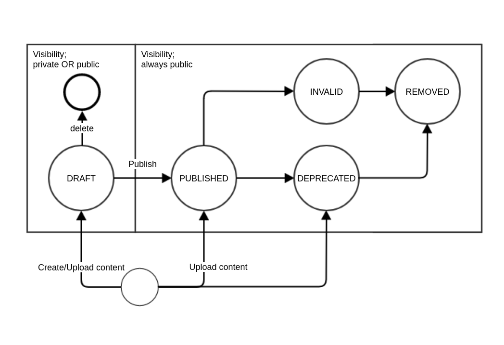

## Content registration

### Basic vocabulary related to MSCR content:

- Registration: Because MSCR is a registry, every added piece of content is registered, hence registration refers to an act of adding a new schema/crosswalk record to the registry (by any means necessary!)
- Referenced schema/crosswalk = Registration of a schema/crosswalk record in MSCR that contain only metadata about the target. Included in the metadata MUST be a link to the downloadable/machine readable version of the schema/crosswalk. There must also always be a reference to an external entity (machine readable or not), otherwise what are we registering.
- Hosted schema/crosswalk = Registration of a schema/crosswalk that includes also uploading of a file (or files?) that specify the schema. Note! Hosted and referenced schemas/crosswalks can have different metadata requirements.

There needs to a clear distinction between hosted and referenced content. With hosted content, MSCR is the primary source of all the data related to the schema/crosswalk and all changes to both the metadata and to the actual content are tracked and stored in the MSCR by registered users of the the MSCR. Referenced content on the other hand can only be used as it is and changes can only be made to the metadata, because if any changes are made to the content itself, it is effectively transformed into a hosted content. This is due to the fact that the source system, or the system where the content is (was) maintained has no record of the changes made within the MSCR.

#### Different levels of registered content

Users should be able to register schemas and crosswalks with different types of content. In the context of MSCR, we can classify the content based on the level of structured data for interoperability they provide.

- At the lowest level is the document based registration. It is perfectly ok to register a schema/crosswalk that is only meant for humans. The downside is of course, that if one wants to create a crosswalk in MSCR from or to this kind of schema, they need to build the whole presentation model themselves from scratch.

- On the next level we have the structural data formats with sprinkles of semantics, such as JSON Schema. This kind of description provides a syntax and possible data type information for the concrete documents to be exchanged.

- Finally, an ontology-based schema description offers a way to present the schema with ontological commitments to shared datatype definitions, vocabularies and ontologies. In the best case, schema registration in the MSCR contains information from all of the levels.

Schema documentation is needed when trying to pick the rights mappings between schemas and since MSCR is focusing on mapping physical models, structural descriptions of both source and target schema are required as part of the mapping data. Finally, ontological information can be used to guide the user and automate some of the steps of the crosswalk creation.

## User Groups
User groups are needed in order to support community driven schemas/crosswalk. MSCR tries to strike a balance between the "wild west" approach where any one can register and create content and the  exclusive, committee-driven invite-only service where additions and changes are less frequent and more planned. Groups are thought of as a feature to support the latter approach. 

- Only system admins can create new groups

    - No explosion of groups (if not wanted by the service owner)
    - Possibility to vet all group creation requests
    - Possibility to keep group creation as a separate process all together.

- Groups can have their own admins and contributors 

- Groups based content can be presented differently from the personal content
    - For example group based content could labeled with "official" tag.

Group related information is maintained within MSCR. Users can be invited into groups with an email/username. User can belong to a more than one group, but can only be active in group at a time. This means that the UI must provide a way to select the active user group. 

User group can have "personal" content similarly to an individual user, which is not available to the public, but accessible by all the members of the group. 

## User Roles

System must support following user roles:

- System admin
    - Create and modify users and groups
    - Content related admin functions

- Group admin
    - Can add new group admins (if specified by the system admin)
    - Can add users to the group
    - Can remove users from the group
    - Can create API tokens for the group
    
- User
    - Can register schemas and crosswalks under personal account and to all the groups involved
    - Can create new versions  of personal and groups’ schemas and crosswalks.
    - Can modify metadata and other content of the personal and groups’ schemas and crosswalks.

## Possible Users of MSCR

### Schema Maintainer
Responsible for development of one or more schemas.

- Registers up-to-date versions of the schema
- Is responsible for the correctness of the schema’s metadata
- Identifies other registered schema for potential mapping candidates (to and from)
- Uses other schemas for benchmarking and further development of their own schema

### Schema Contributor
Participates in the development of one or more schemas. Has in-depth knowledge about one or more schemas. Is interested in helping others to use the schemas she/he is involved with. 

- Maintains and implements mappings to other schemas
- Comments mappings of familiar schemas

### Researchers
- Is not interested in registering schemas,
- Might be interested in registering crosswalks
- Utilizes crosswalks in order to integrate data from different sources for research purposes
- Potentially complex schemas

### Data engineer/integrator (developer)
- Searches for registered schemas crosswalks based on given requirements (Implement API that support specific schema)
- Utilizes existing crosswalks as is
- Creates new crosswalks that are based on existing mappings
- Creates ad hoc crosswalks to custom internal schemas
- Moves data from one system to another with aETL workflow for discovery purposes
- Focus on metadata: Wants to add a new export format to the existing API.

## Authentication and authorization

The user must be able to register/login using either the internal user database or External AAI service.Currently MSCR is integrated with B2Access Production AAI.Integrating with a well-connected federation ensures that users can easily access the MSCR regardless of their home organisation. 

## API tokens

API tokens can be created for both users and groups. Group API tokens can be used as a sort of service accounts that can be configured for automated use of the MSCR API. For more information see  (See [Using MSCR with API](./api-usage-guide.md))

## Supported schema description formats

These are the files types that can be uploaded as part of the schema registration process. 

#### Prioritized list of possible schema description formats:

##### CSV 
- First one because of the simplicity. Basically list of field names. Default and only datatype is string. 
##### JSON Schema
Incoming schemas are validated based on their $schema property. 

- Only certain JSON Schema version will be supported
- Only a subset of meta schema features might be supported for each JSON Schema version. 
##### XSD
- can be validated
##### SKOS RDF
- Preferred format for vocabulary schemas imports
##### SHACL
- Can be used to import schemas
- Validated against the MSCR schema 
##### OWL
- For core vocabulary imports
##### The rest
- RDFS
- CSV Schema

A brief smmary of MSCR supported formats and media types are given below: 

| Format      | Media Type      |   Mappable   |  Sub Type  | Notes|
| ----------- | ----------------|--------------|------------|------|
| `CSV`       | text/csv        |Yes           | Data Schema|File must contain only one line with fields separated by comma|
| `XSD`       | text/xml        |Yes           | Data Schema | Not all features of XSD supported|
| `JSON Schema`| application/json | Yes        | Data Schema |Implementation based on draft-04.No support for allOf, oneOf, anyOf or not.|
| `RDFS`       | text/turtle        |Yes           | Data Schema |Processed as data schema (see X) so visualization requires the use of rdfs:domain and rdfs:range properties.|
| `SHACL`       | text/turtle        |Yes           | Data Schema | Only supported  RDF format is turtle|
| `OWL`       | text/turtle        |Yes           | Ontology | Only supported RDF format is turtle|
| `SKOS`       | text/turtle        |Yes           | Vocabulary | Only supported RDF format is turtle|
|`ENUM`	        |text/plain	       | Yes	| Vocabulary	|One line per term.|
|`PDF`	        |application/pdf	       | no	| 	||

All uploaded schemas are processed into a common SHACL based graph and visualized in a unified manner. 

## Supported crosswalk description formats

These are files types that can be uploaded as part of the crosswalk registration process.

#### Priotized list of supported crosswalk description formats:

##### TXT/PDF
although not technically a structured format, text files that contain  a description of (a set of) mappings will be supported, simple data management can take place on this type of files, but they are not processed as part of the import.
##### Simple mapping table
Converted into internal format and editable
##### SSSOM Mapping set
Converted into internal format and partly editable
##### XSLT
XSLT files can be registered, but they are not processed as part of the import. This means that this kind of content can be utilized as part of the transformation service and but cannot be visualized or edited using MSCR. 
##### The rest
RML- Could be converted into internal format. Source schema format must be RDF.

## Related content - Versions and variants

### Open questions:

- What happens if one version changes owner? Should the ownership of all the versions be changed?

There is no need to keep track of all the changes related to hosted content. It is enough to record manually curated version information. Versions populate a version graph that can be utilized in the schema/crosswalk view to show previous/next versions. User can take other user's registered content as a starting point for a new version. 

MSCR versions both metadata and actual data i.e. each version has its own metadata and file instances. MSCR content available for versioning consists of schemas and crosswalks. 

Usage scenario: Adding Datacite versions 3.1 and 4.0 in XSD schema format

* User creates a new schema

  
   {

    "Metadata": {
         "Label": "Datacite",
            "VersionLabel": 3.1,
            "Change notes": 
                    "New affiliation attribute for Creator and Contributor,
                     New relationType pairs IsReviewedBy/Reviews and IsDerivedFrom/IsSourceOf,
                     New contributorType: DataCurator,
                     New relatedIdentifier types: arXiv and bibcode",
            "Files": "Datacite_3.1.xsd"
            }     
    }

* User navigates to the Datacite schema and selects "create new version". Schema registration form is shown with metadata prefilled from the previous version. Changes notes metadata field is empty. User adds/changes the following data:

{
        
    "Metadata":{
        "VersionLabel": 4.0
            "Change notes":
                "something something",
        "Files":
            "Datacite_4.0.xsd"
    }
}
            
Usage scenario: Creating a new crosswalk based on an existing one

* User navigates to the "Datacite 3 to Dublin core" crosswalk that was created with the crosswalk editor.
* User select "Create MSCR copy". Format (MSCR) and the source and target schema stay the same.
* System copies the crosswalk  metadata and content and sets the state to DRAFT.
* User can edit the metadata and content. 

One piece of content and its revision graph is like a Github repository with a single branch where revisions are similar to Github's releases. Each revision has a state that that goes from e.g. draft to published to deprecated. Changes to data are only allowed when the content is in draft state. Metadata can be edited freely without the need to create a new version. For example, content can be transferred to a new maintainer and typos in the description can be corrected. 

Variants are implicitly related content:

* Schema variants share the same namespace
* Crosswalk variants share the source and target schemas.

In addition to adding a descriptive title, the schemas can be described using version label and namespace metadata. 

* Namespace is an URI that works as a public "identifier" for the schema.
* In an ideal world, there would be only one registered schema per namespace. In reality, different owners will register schemas with the same namespace for different reasons. 

Relations between content (i.e. schemas and crosswalks)

    :x prov:wasDerivedFrom :y
        Prerequisites:
            Owner (=creator) of :x is not the same user as the creator of :y AND the creator :x is not part of the same group as the creator of :y 
             :x was created using :y as the starting point i.e. the initial content of :x was copied from :y.  
    :x prov:wasRevisionOf :y
        Creator of :x is the same user or part of the same group as creator of :y
        :x was created using :y as the starting point i.e. the initial content of :x was copied from :y.  
        Revisions share the same aggregation key
    y: mscr:hasRevision :x
        Inverse of prov:wasRevisionOf
        Supports branching i.e. can have multiple values
    x: mscr:hasVariant :y
        Schemas:
            :x and :y share the same namespace AND have different aggregation keys i.e. :x and :y are related but not revisions 
        Crosswalks:
            :x and :y share the same source and target schemas AND have different aggregation keys

## Versioning in UI

Versioning related actions are available under "Actions" menu for both schemas and crosswalks.

There are two versioning related actions available:

### Add a new version
            
For example to make a bug fix to a published content. Available for all schema/crosswalk formats and in all the states.

* Format cannot be changed and it is copied from the content being versioned. In case of crosswalk, target and source schema must stay the same.

* If the format of the content being version is other than "MSCR", a file upload/URI is shown in the versioning modal.

* If the format is "MSCR", content graph is copied.
    
### Create a MSCR copy

Turn file based content into MSCR only content. MSCR content is the prerequisite for schema editing (e.g. DTR datatype edits)

* Available when schema format is something that has been processed to MSCR's internal format
            
            Schemas: MSCR, CSV,XSD,JSONSCHEMA,SHACL
            Crosswalks: MSCR, SSSOM

* State of the new copy is always "DRAFT" and format "MSCR".

New version modal should re-use the registration modal with the following changes:

* Format is fixed (schema and crosswalk)
* Source and target schemas are fixed (crosswalk)

## Content status and visibility

New content in DRAFT state can be created with minimal metadata. Visibility of a DRAFT content can be changed from private to public and back. Public draft content can be used by external parties, but it might go away at any moment. Visibility refers to the visibility of the content and metadata is always indexed internally and can retrieved with an id. 

Registering content created within MSCR (e.g. crosswalk) means describing the content with some additional metadata and making it visible to the public. Once content status has been set to PUBLISHED it cannot be hidden any more. Published content can be moved to either INVALID (something went wrong) or DEPRECATED (still valid, but newer version preferred), which are the final statuses for content. 

* If users are allowed to delete content, it could be set to REMOVED (or ARCHIVED) state and hidden from all but administrator users. 

* Resolving a PID related to deleted content would result in a tombstone response.

* Draft content can be deleted without a trace (provenance event is generated).

#### Status/visibility in the API
* New files only be added to DRAFT content
* New content can be create with DRAFT, PUBLISHED and DEPRECATED statuses
* Visibility of DRAFT content can be PRIVATE or PUBLIC. For all the PUBLISHED, DEPRECATED and INVALID the visibility is always PUBLIC. 
* Metadata can always be changed without restrictions

#### Status/visibility in the UI
All new content goes to DRAFT status initially with visibility "PRIVATE".

## Content structure
### Structural schema vs. vocabulary schema
The main difference is that the latter can be used as a "values from" target of a property. 

Based on the requirements gathered at the beginning of the project, it is clear that there is a need to provide both schema and codelist/vocabulary level mapping as part of the MSCR.  

Schemas
--
    PID:A
        {
            "value": string,
            "value_generation_method": number
        }
    PID:B
        {
            "value": string,
            "method": string
        }
 
    PID:A.list
        A value generation methods
        1
        2
        3
 
    PID:B.list
        B value generation methods
        A
        B
        C
     
Mappings
--
    A.value = B.value
    A.value_generation_method = B.method
    A.list.1 = B.list.A
    A.list.2 = B.list.B
    A.list.3 = B.list.C

Example of a flat schema. Eg XSD schema can contain e.g. hierarchical structured which will result in a more complex schema/mapping representation.

### Implementation of the content structure

We have decided to implement the simplest content structure, where each schema is described as a resource and those schema resources can be linked together with versioning related properties (such as previousVersion, nextVersion). This would be the structure available in the graph store. For search and browsing purposes it is possible and maybe even preferable to aggregate versions around set of shared metadata. For example organisation/user and namespace of the schema. This would allow for example the search interface to show only one result row per namespace for a single organisation/user instead of showing one result row per schema version.   

    :schema1 a :Schema
        :namespace <http://example.com/todos> ;
        :owner :org1 ;
        :label "My custom schema" ;
        :aggregationKey "key1" ;
        :versionLabel "1".
        :nextVerion :schema2
 
    :schema2 a :Schema
        :namespace <http://example.com/todos> ;
        :owner :org1 ;
        :label "My custom schema" ;     
        :aggregationKey "key1" ;
        :versionLabel "2" ;
        :previousVersion :schema1 

    "results": [
        {
            "namespace": "http://example.com/todos",
            "label": "My custom schema",
            "numberOfVersions": 2,
            "latestVersion": "2"
        }
    ]

## Schema namespaces 

When a user registers a new schema (i.e. it is not a version of any other registered schema), it must be given a local identifier.  User can input the identifier of namespace by giving it as an URL (e.g. http://www.wikidata.org/prop/) or as a simple string (e.g. "test"). If the identifier is omitted, one will be generated. Simple strings will be concatenated with the MSCR's URI prefix in order to create resolvable URLs (e.g. http://mscr.someorg.fi/schema/test). However, the namespace does not need to be resolvable and even if it is, the content is not used in this context in any way. 

Schema namespace information is used aggregate schema versions together within the owner's scope. The owner can the either a user or a organization. Namespaces can also be used to display variants of the same namespace across owners. For example users X and Z could have registered versions of the namespace. This information can be made available as part of the UI and for example show existing variants as part of the schema registration process. 

### Mappings between different type of schemas

Schemas in MSCR can be divided into four groups:

* Unstructured schemas
E.g. PDF format. These schemas are only stored and no other processing happens at the time of registration
* Tree
* Graph schemas
* Vocabularies

## Notifications

Notifications are essential for keeping crosswalk maintainers and user using the best available versions. Registered users can register for notifications about new versions for any number of schemas and crosswalks. Notifications can be delivered via email or they can trigger a webhook. The latter is targeted towards automated processes.

Notifications should be implemented in an efficient, asynchronous way that is separated from the actual processes of creating new versions. It would be very easy to check for new versions of a specific schema/crosswalk if the content would be organized in a hierarchy where versions of the same content are all part of the same resource. 

## PID management

#### Hosted Contents

The system provides a configurable metadata record for every PID.Resolvable PID URLs must support content-negation for both humans and machines.

MSCR uses handles with part identifier. Content always has only one PID. Part identifiers can be used to access metadata and content individually. 

#### Referenced content

Referenced schema and crosswalk content must provide an existing identifier as part of their metadata. This identifier must be something that can be used to access the actual content directly. No landing pages. The identifier can be for example an URL. 

## Schema editing

Schema editing is based on original core model/application profile editor that is developed by the DVV. Schema editor is a simplified version of the original editor containing only minimal options (label, datatype, cardinality). Schema editor provides a way to create a new version of a registered schema. The new version can be saved as a revision (strong connection between versions - think of "save" in the Word) or as a new version ("save as" operation). All schemas registered from the schema editor are hosted schemas.

The benefits of turning a file based CSV, JSON Schema or XML Schema based schema in to an internally editable schemas are:

* Possibility to assign DTR data types to any property.
    This can be in turn used to show existing mappings as suggestions in the crosswalk editor
* Addition of cardinality information can be used to validate mappings in the crosswalk editor
        Warn user if the user is adding a mapping from multivalued property to single value property.

## Internal data model

* RDF for flexibility.
* SHACL for schema fit.
* Custom extension for physical models

Crosswalk representation can include:

* Mapping between input and source document structures 
* Mapping between vocabulary based property values 
* Mapping between properties with DTR data types

## Faceted search

MSCR implements a separate search endpoint for faceted search (/mscrSearch), which support both text query and filtering based on facet values. Parameter "query" is used for full-text queries. Additional filters can be by other parameters. Multiple values can be set by adding the same parameter multiple times.  Endpoint returns results from the OpenSearch search index in their original format. 

Only public content is searchable.

### Search Parameters:

    query
        full-text query value
    Filters:
        type= schema|crosswalk
        state=DRAFT, PUBLISHED, INVALID, DEPRECATED, REMOVED
        org=<pid>
        format=CSV|JSONSCHEMA|XSD|PDF|SKOSRDF|XLST|MSCR
        sourceType=HOSTED|REFERENCED
            Whether the content is maintained using MSCR (HOSTED) or not (REFERENCED). 
        sourceSchema=<pid>
        targetSchema=<pid>

    Sorting:
        sortLang
    Pagination
        pageSize
        pageFrom
    Display
        prefDisplayLang
        includeFacets= true|false
            if true, return facet information as part of the result document. All other parameters can be used even if this parameter is missing or set to false.

Facets:

    type
    state
    format
    organization
    sourceType

It is possible to create combination of params that will not return anything ever. For example crosswalk that has more that one sourceSchemas. Facets values are currently always combined with boolean operator OR.

Query and facets are always combined with boolean operator AND.

Examples

    GET /mscrSearch?query=csc&type=crosswalk&sourceSchema=pid1&sourceSchema=pid2
    
        Returns crosswalks where textual descriptions contains "csc" and have "pid1" OR "pid2" as sourceSchema. 

    GET /mscrSearch?type=schema&type=crosswalk&org=pid1&org=pid2

