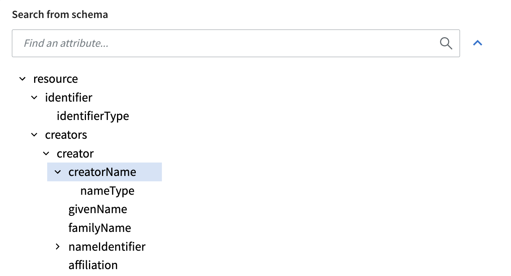
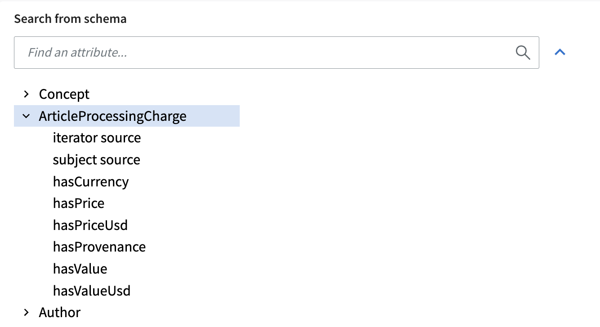
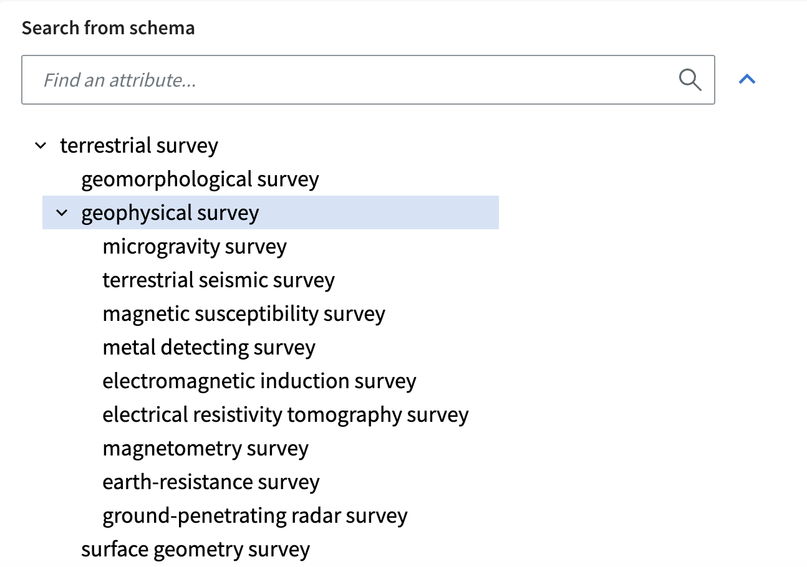
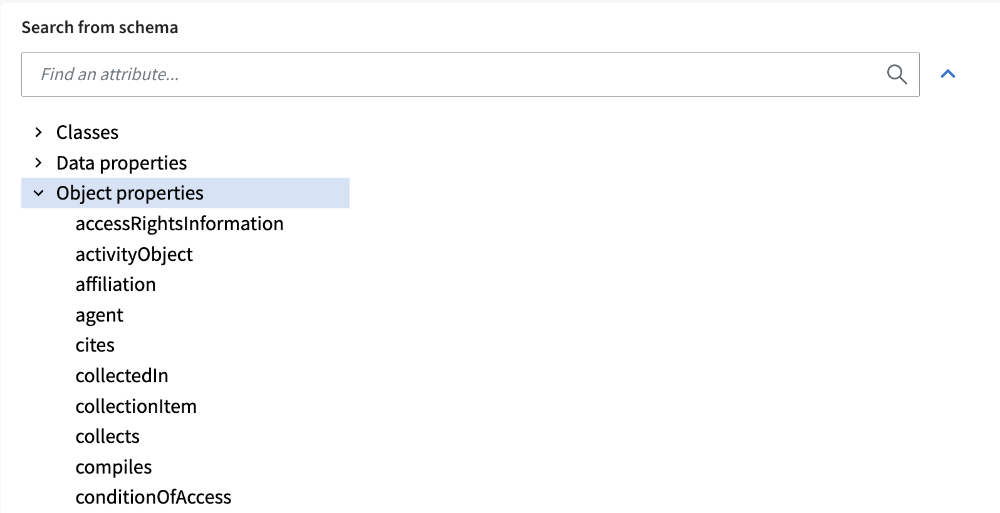
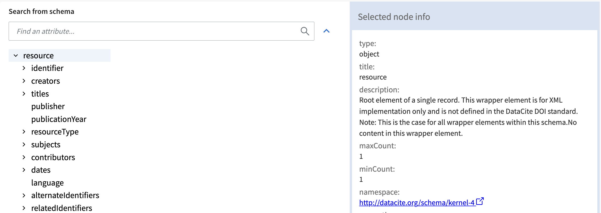

##  Schema visualization
 Based on schema formats, schemas are visualized in MSCR a bit differently to make it easy for the users. Different visulizations are listed below:

### Tree-base schema

The basic  tree structure that materialises all the possible nodes is used for CSV, JSON Schema, XSD and SKOS Schemas.

### Graph schema
 
SHACL and RDFS schemas are visualised using a tree where the root contains classes referenced in the schema with associated (either with sh:property of rdfs:domain) properties as child elements. 

SKOS and ENUM vocabularies show the full hierarchy. 

### Ontology

OWL ontologies have a special representation that divides the tree into classes, data properties and object properties 

When a user selects a node from the tree a detailed node info box is shown on the right-hand side (see figure below) containing all the information that was extracted from the schema specification file. The actual content is again dependent on the schema format. For example, it is not possible to provide a description of a column within a CSV schema, because the only piece of information available is the name of the field. 

### Node info 

Describe main properties 

## Editing schema 

### Integrating DTR data types 

### Setting allowed values

