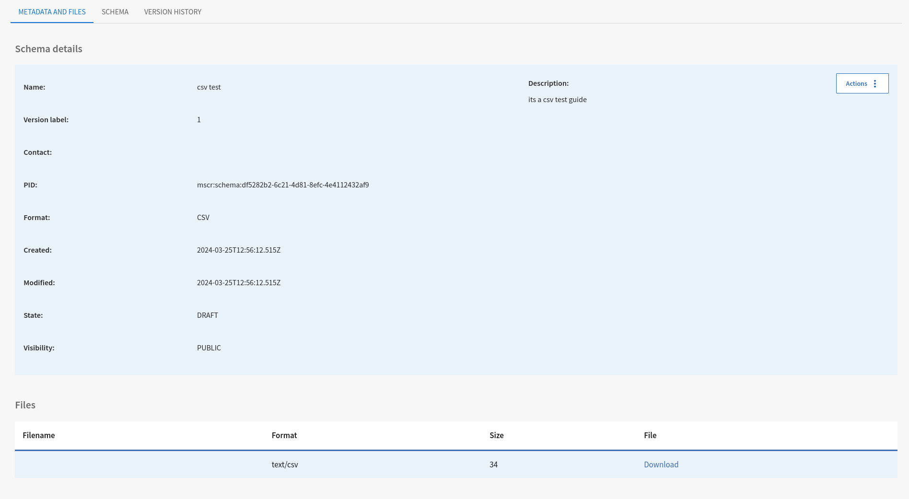

## Login
To be able to create and register contents in MSCR, user needs to login with proper credentials. MSCR uses EOSC AAI and currently supports Google and Orcid as means of authentication. The current test version of MSCR deployment can be found at [MSCR Web App](https://mscr-release.2.rahtiapp.fi/).

## MSCR Home
After login, user should be able to see user's own workspace and the groups those which the user is part of. Both personal workspace is again divided in two main page- schemas and crosswalks. Schema page contains the schemas the user or his group have registered in MSCR and same for the crosswalks.

## Contents in MSCR
The MSCR contents can be divided into two main categories. They are, Metadata Schemas and Crosswalk(See [MSCR Concepts](./functional-overview.md)).The features that MSCR provides to manage the contents are mainly registering those contents in MSCR and different functionlities to manage them. 

## Content Registration 
### Schema Registration
Users can register their schemas of different formats in the MSCR and it will be stored with a resolvable handle in MSCR server. These handles can be used to reference the schema stored in MSCR. User can register schema either using an URI of already published schema elsewhere or uploading a schema file to MSCR Registry.

The steps to add a schema in MSCR are as follows:

- Provide an URI or upload a schema file
- Select the file format for the intended schema.
- Add Name and Description (optional) for the schema.
- Add status (Default status should be DRAFT for the registered contents)
- Click Register button to continue.

##### Schema Registration with File Modal

##### Schema Registration with URL Modal

If the schema registration goes successfully, the user will be navigated to schema metadata tab where all the metadata related to the regsistered schema is shown.

### General Error Situations while registering a schema
If the schema registration is unsuccessful, user will be prompted with the error message. The main issues currently for a failure to register the schema can be one of the following:

 - Unsupported File Format.
 - Parsing Error.
 - Missing field in the Form.

### Registering Crosswalks

Users can register their existing crosswalks with MSCR and can view the crosswalk in crosswalk editor if the crosswalk format is supported by MSCR. For registering a crosswalk follow the following steps:

- Select the source schema and target schema from the dropdown list. Remember, source and target schemas also need to be registered with MSCR and the visibility should be public before registering the crosswalk.
- Add the crosswalk file in the MSCR supported formats. See more in the supported formats link.
- Add name and description for the crosswalk.
- Draft state should be selected while registering new content.

 

## Schema Management in MSCR

The basic functionalities that is available for schema management are

* Registering own Schemas or schemas hosted elsewhere by URL as draft.
* Visulizing the Schema with a schema tree (exception PDF schemas)
* Creating revisions of Schema
* Creating MSCR Copy of the Schema
* Deleting the Schema
* Publishing the schema.
* Type Editing for the schema properties

How these functions can be done in UI, is described below:

### Schema Detail View

After the schemas has been successfully registered, it is browsable using the MSCR schema view. Schema view is divided into three tabs. "Metadata and files" tab shows all the metadata available for the content and lists download links to the original content as well as links to the generated internal representation for CSV, XSD and JSONSchema formats. "Schema" tab shows a visualization of the schema using a tree structure. The content of the tree is dependent of the schema format. For CSV, XSD and JSONSchema the tree shows the fully materialized structure of the schema (see figure X) i.e. all the possible elements. And the last one is the "Version History" tab which is the list of the revisions created for this particular schema in the MSCR Registry.

#### Schema Metadata Tab
You can see the schema specific details and the related files in the schema metadata view. If the user has the correct rights, schema metadata is editable and changes will be saved.

To edit the schema metadata, one needs to select "edit metadata" from the schema action menu. After clicking it, fields of schema metadata will become and editable and changes need to be saved for the edit to be successful.

#### Schema Visualization
Schema visualization tab offers a tree view structure for the registered schema. Schemas are converted to an MSCR specific format and tree view is generated from that. The view may be empty for certain formats like PDF that cannot be rendered as a tree.

##### Different Schema Visulization of various Schema Format

#### Schema Version History
MSCR allows users to create and store different versions and variants for registered schemas. Schema version history tab consists of all the available versions for that specific schema.

### Action Menu for Schema Visulization Tab

The basic actions available for the schema manipulation in the current MSCR UI are:

* Edit Metadata
    - Edit the metadata of the schema.

* Invalidate schema

* Deprecate schema
    - Means there is new version available for the specific schema which is preferred
* Add new revision
* Make MSCR Copy

### Creating MSCR Copy of a Schema

mkdocs
User can create a MSCR copy of the registered schema which transform the schema into internal format used in MSCR. This is a prerequisite for schema editing. This option is available when schema format is something that is possible to process to MSCR's internal format, whih are currently CSV, XSD, JSONSCHEMA, SHACL. State of the new copy will be always "Draft" and format will be "MSCR".

Creating MSCR copy is not available for schemas which are already in "MSCR" format.

### Creating a new revision of Schema

It is possible to create a new revision for the registered mscr schemas. The need for creating revisions can be that user wants to do some corrections or bug fixes to some already published content. The steps are almost like registering a new schema with some differences.

- User need to provide the schema file either as normal file upload or the URL
- Format and State of the content cannot be edited while creating a revision. So, revisions of the schema should be if the same format as the main content.
- Some meaningful name and description will help the user to find it easily later.

### Search Contents in MSCR

MSCR provides basic search and browse functionality for all schemas and crosswalks that have their visibility set to public. This means that all content than is not in DRAFT state is findable through the search. There is a search box at the top right corner of MSCR UI, where user can type the name of the content he is searching for.

Search returns only the latest revision of the content by default. This means that if there are older revisions that might have slightly different metadata (e..g the name) it might not come up in the results. 

