# Vocabulary Service
The Vocabulary Service collects and maintains common terminological vocabularies and concepts for community use. For example, researchers of a specific community can define concepts and their relationships using this service. Interested users can browse and check concepts and their definitions.

It was a late addition to the FAIRCORE4EOSC components ​and developed based on active code base from Finnish Interoperability platform ​which is developed by the Digital and Population Data Service Agency of Finland​.It was originally built for managing terminologiesbut this particular instance is deployed and customized by the FC4E project​

## Main Features
- Graphical Interface to Create, maintain and publish vocabularies​.
- Support for SKOS-XL model​
- Separate status handling (VALID, DRAFT etc.) for vocabularies and concepts​
- Supports Import and export content using Excel​
- Linking within and between vocabularies​
- Resolvable PIDs for vocabularies and concepts​


## Searching and browsing

In the vocabulary tool home page, a list of all the vocabularies in alphabetical order is visible.By clicking on the Vocabulary name in the list, User can view its contents,Metadata and possible actions. Users can also perform faceted searcg using the filtered search box found in the right side of the home page. It is possible to limit the search for vocabularies in the sidebars in the following ways:

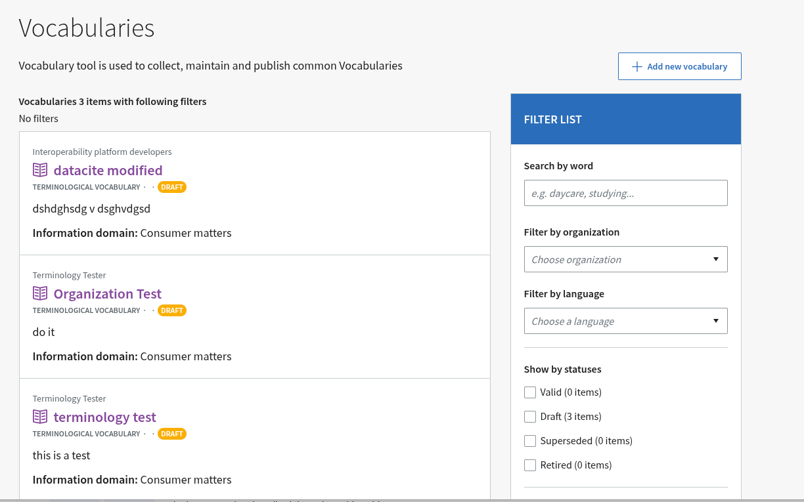

- With word search, User can search vocabularies and concepts, just like with the search in the top bar.
- If User only wants to see vocabularies created by a specific organization, select that organization from the drop-down menu.
- User can also choose which status he/she wants to see the Vocabularies in in the list. The options are: Valid, Draft, Superseded, Deactivated.
- User can also choose which knowledge areas for the Vocabularies in the list.

User can also search for vocabularies and concepts by typing the desired search term in the search field in the top bar. Then press enter key or the magnifying glass icon next to the search field.

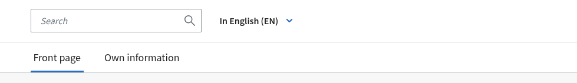

## Adding vocabulary

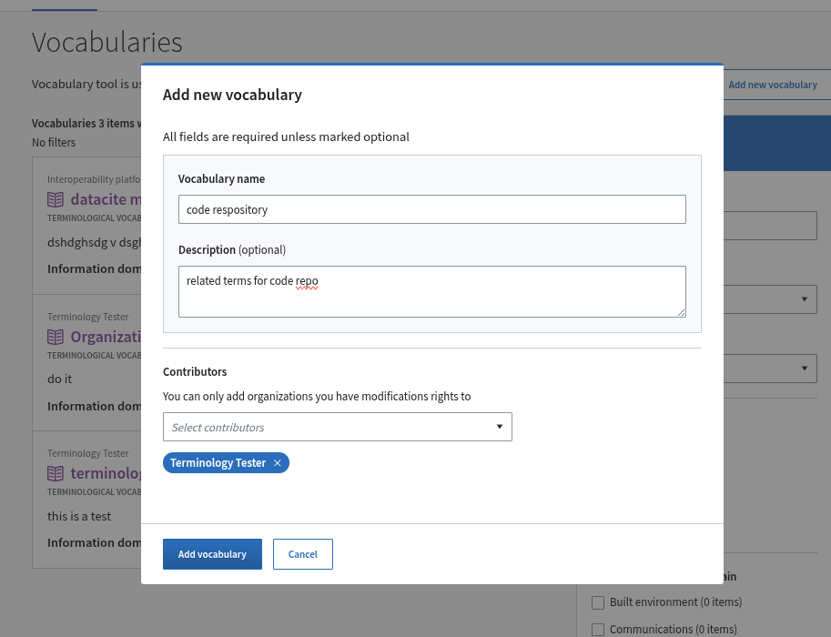

User can add a new vocabulary clicking the "Add new vocabulary" button on the tool's home page. This will open up the modal where user need to put name and description(optional) and organization selector to create a new vocabulary. The created vocabulary will have draft PID and some metadata associated with and will get status Draft.

Clicking the create button, user will be navigated to detail page after successful creation of vocabulary.

## Vocabulary page
Vocabulary detail page consists of vocabulary metadata and different actions like adding concepts or downloading or uploading concept for that vocabulary. The user needs to have editing right to be able to see all the allowed actions related to a vocabulary.

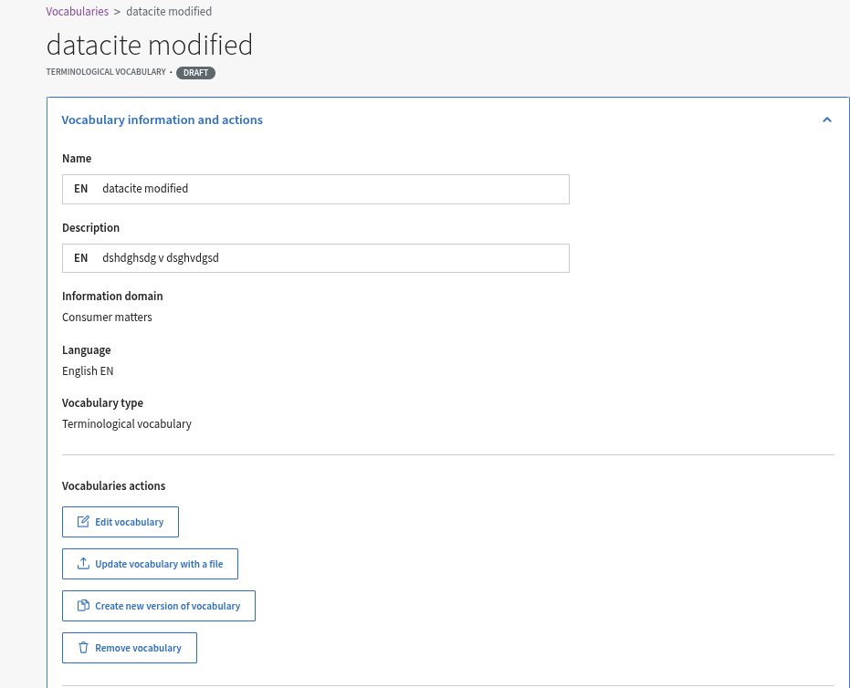

Clicking the small down arrow icon in the vocabulary information and actions window will show the possible actions and details of the vocabulary. 

## Concept page
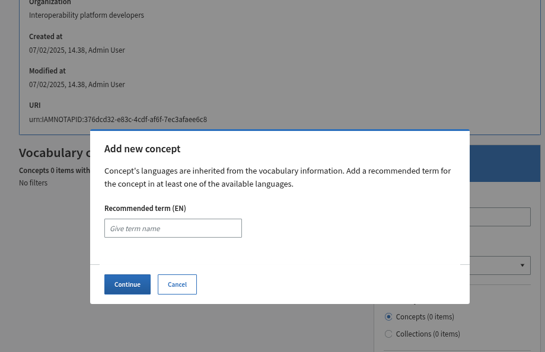

## Importing concepts using Files

The tool has three ways to update vocabulary information using files:

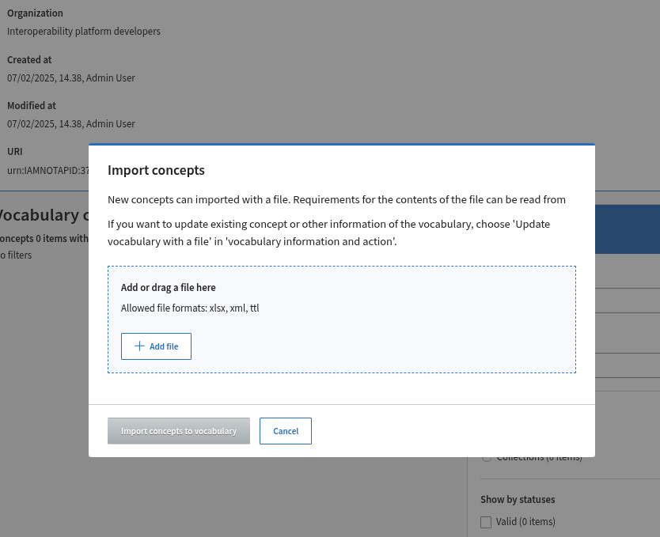


Simple Concept Addition Excel for adding new concepts to an existing vocabulary,
XML import, i.e. a file in the NTRF format for Nordic terminological data and SKOS Turtle import. 

### Adding new concepts to the vocabulary using an Excel file

Follow these steps if you want to add new concepts to an existing vocabulary. The simple Excel import only import basic concept information and it cannot be used to import relationship information.

[Example Excel import file](../assets/concept_import_excel_example.xlsx)

Note: Do not update existing concepts in this Excel file. If you update existing concepts with this file, the concepts will appear twice in the glossary.

1. Download the example Excel file for importing concepts.

2. Add the desired information to the concept import file you downloaded and save the file. Make updates to the file following the instructions in the file.

3. Select "Import concepts" from the vocabulary where you want to add the concepts.

4. Attach the desired file and click "Import concepts to the vocabulary". This will open the vocabulary's home page and you will see the concepts you added in the concept list.

### XML Import 

XML import uses [NTRF model](https://nordterm.net/filer/NTRF/Ntrf.pdf). 

Example: 

```
<?xml version="1.0" encoding="UTF-8"?>
<VOCABULARY>
    <RECORD numb="c1" stat="VALID">
        <LANG value="en">
            <TE stat="VALID">
                <TERM>Test recommended term</TERM>
            </TE>
            <SY stat="VALID">
                <TERM>Test synonym</TERM>
            </SY>
            <DEF>Definition</DEF>
        </LANG>
    </RECORD>
    <DIAG numb="collection-1" name="Test collection">
        <LINK href="#c1">c1</LINK>
    </DIAG>
</VOCABULARY>
``` 

### Import existing SKOS vocabulary 

The SKOS file must be in Turtle format and it must contain both skos:Concept and skos:ConceptSchema resources. SKOS import handles also the relationships between concepts. 

Note: 
The SKOS import keep and use the original URI of concepts so it is up to the importer to make sure those URIs point to the correct place. 

## Editing vocabulary information and deleting a vocabulary
Open vocabulary information and functions from the selection bar

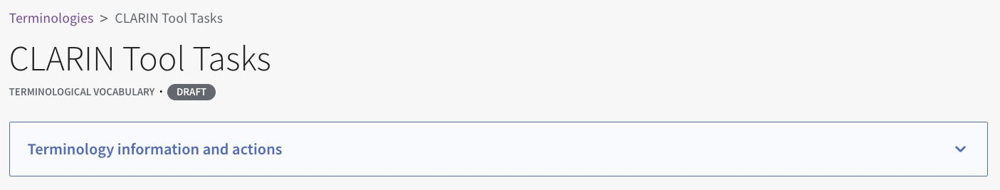

By clicking on the line "Vocabulary information and actions", you will see the following additional information:

* Vocabulary name and description
* Information domian the vocabulary belongs to
* Vocabulary languages ​​and vocabulary type
* Organization responsible for the content
* Version information and web address, or IRI


If you have permission to edit the glossary, the glossary and concept function buttons will also appear, which are explained in more detail in the following paragraphs.

### Vocabulary actions

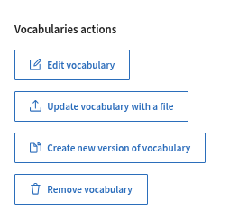

**Editing the vocabulary**. Once you have created a glossary or otherwise have permission to edit the glossary, you can add concepts to it, or make changes to the glossary after it already contains concepts. To edit the information generated during the creation phase, select "Edit vocabulary".

**Updating the vocabulary with a file**. You can also edit the vocabulary by importing a new version as a file. To do this, select "Update vocabulary with file". For more detailed instructions on updating the vocabulary with a file, see page 6.1 Updating vocabulary data with a file .

**Creating a new version of the vocabulary**. You can create a new version of the vocabulary by selecting "Create a new version of the vocabulary".

**Changing the status of the entire vocabulary.** You can change the status of the vocabulary through the editing function. First select "Edit vocabulary". Select from the list which mode you want to change the vocabulary to and finally press "Save". Changing the status of a glossary does not change the status of the concepts and terms included in the glossary. The status of concepts and terms must be changed separately under the Concept functions heading, under "Change concept status information".

**Deleting the vocabulary**
You can delete the vocabulary completely by selecting "Delete Vocabulary". NOTE! You cannot delete an existing vocabulary because it may have been referenced. In that case, change the vocabulary status to Disabled or Replaced if the vocabulary has been replaced by another vocabulary.

### Concept actions

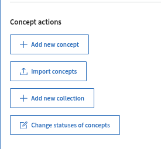

**Adding a concept**. 
You can add one or more concepts to the glossary by selecting "Add new concept". Adding a concept is done as described in section 3. Glossary home page#3.Glossary home page-Adding concepts to the glossary .

**Importing concepts using a file**.
You can import concepts into the vocabulary using a file by selecting "Import concepts". More detailed instructions on importing concepts using a file can be found on page 5. Importing concepts using files .

**Adding a collection of terms to the vocabulary**.
You can add a new concept collection to the vocabulary by selecting "Add new collection".
First, fill in the basic information for the concept collection.

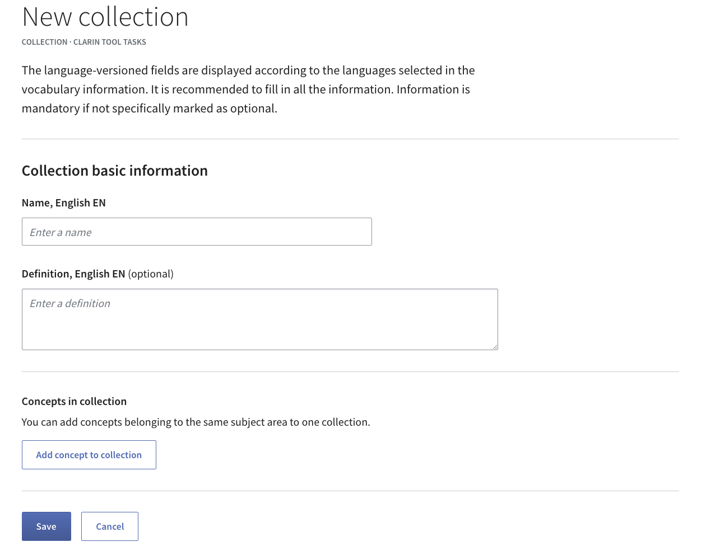

Select "Add concept to concept collection" to add concepts to the concept collection.
Save your changes by selecting "Save" at the bottom of the page.
You can also create a concept collection by importing a new version of the glossary as a file.

**Changing the status information of concepts**

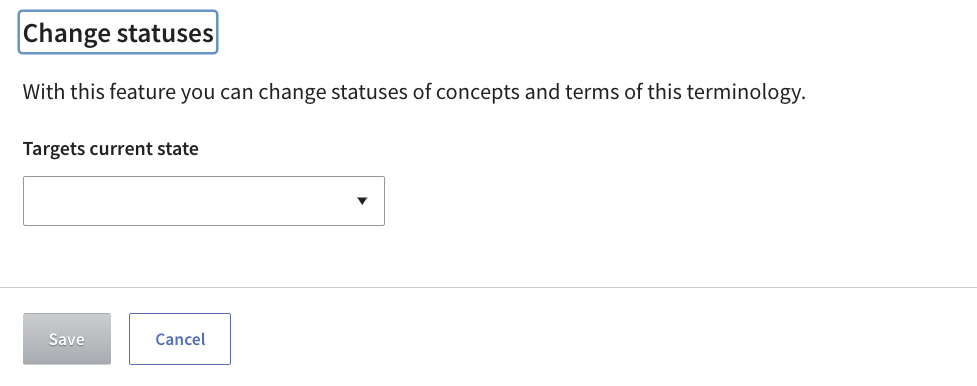

You can change the status information of concepts by selecting "Change status information of concepts". i.e. by so-called mass change.
Note that both a concept and a term can have state information and are not dependent on each other. Therefore, when changing the states of concepts and terms, one must consider whether the information of the concepts, terms, or both is being changed. 
Then select the initial state of the items to be changed from the selection list.
Note! This functionality allows you to change the status of all concepts and/or terms in the glossary, for example from draft to valid. You can change the status of an individual concept from the concept's own page.

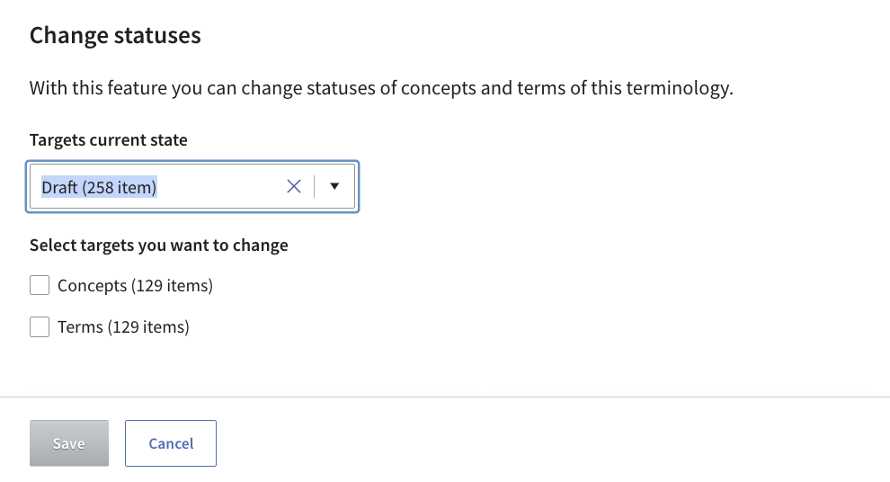

Next, select concepts, terms, or both to edit the states.

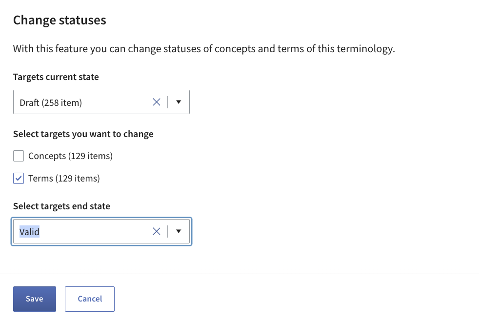

Select the status you want to change the items to from the list and finally press "Save".

## Subscribe to notifications about changes to dictionaries

You can subscribe to receive email notifications about changes to the vocabulary by selecting "Subscribe to notifications". You can cancel your subscription by clicking the "Remove notifications" button.

